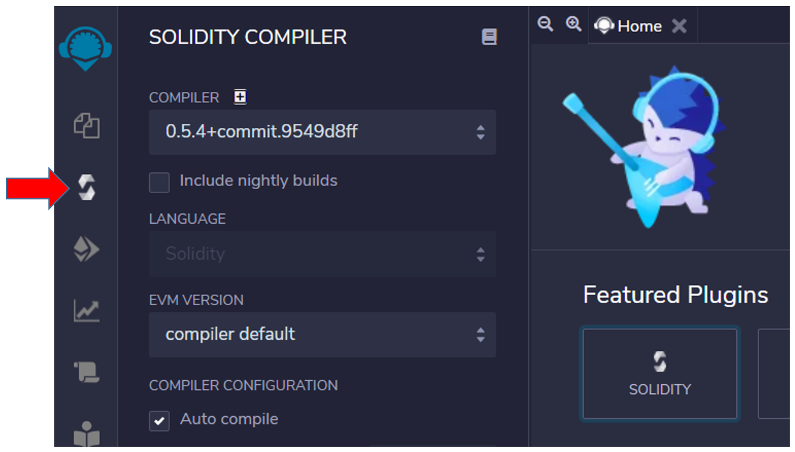
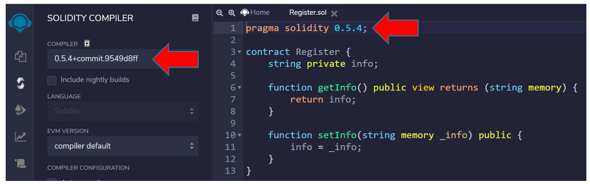
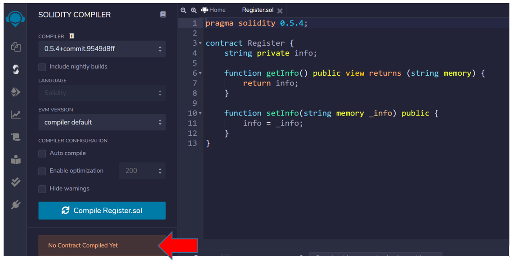
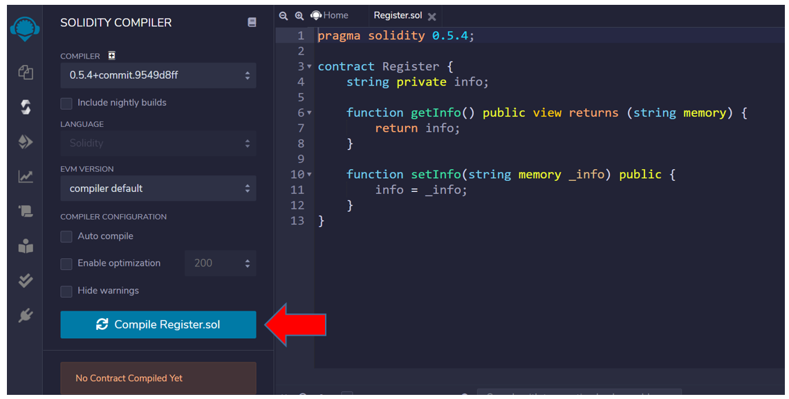
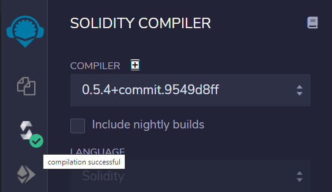
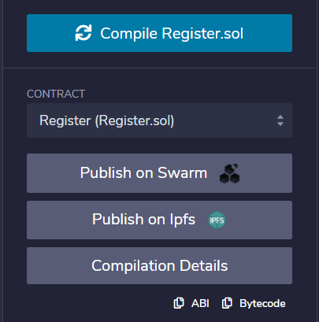

## Compiling the smart contract Register

If you enabled auto-compile, the smart contract is already compiled and a green light will appear next to the third button from the left - Solidity compiler.

If you haven't enabled it, perform the following steps:

1. Click on the 3rd button at the left side, selecting Solidity compiler

The compiler version is usually updated automatically when it is defined in the smart contract, but you can check it out:

I usually enable auto-compile, but I disabled now to show that the smart contract has not been compiled yet:

2. Click on the button `Compile Register.sol`.

3. Check the green signal on the 3rd button with the message `compilation successful`:

4. Also check the part below in the left panel, where presents the details of the compilation:

> [!NOTE]
> ABI and Bytecode are required for the publication of the smart contract.
