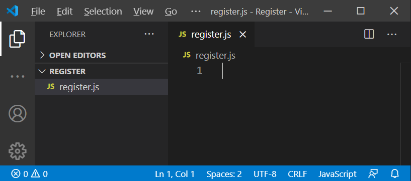
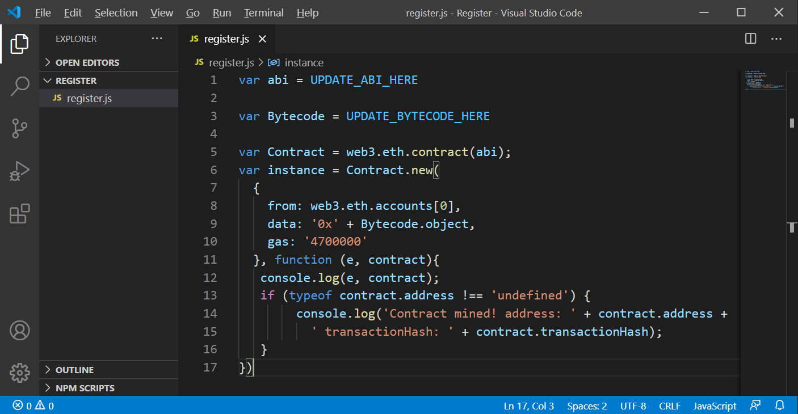
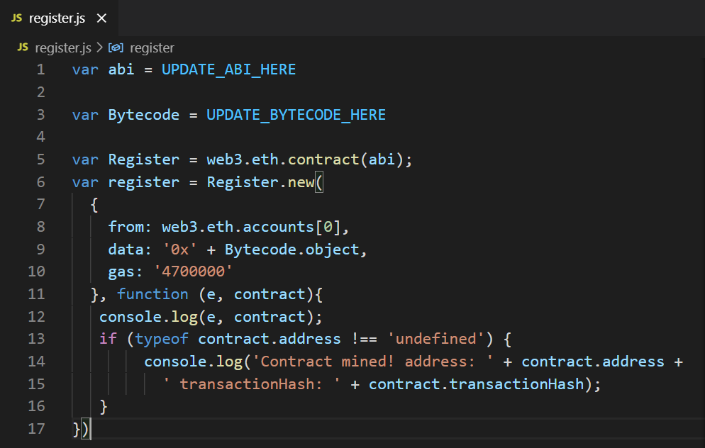
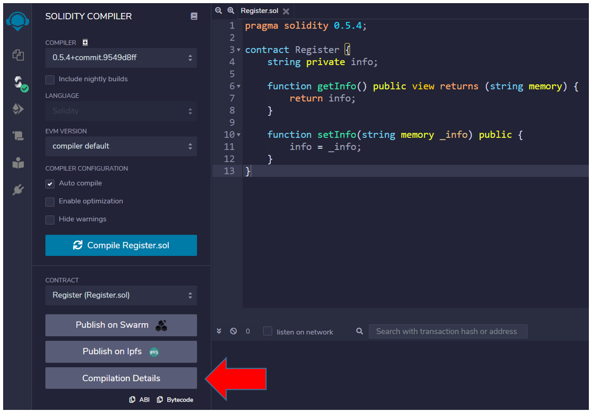
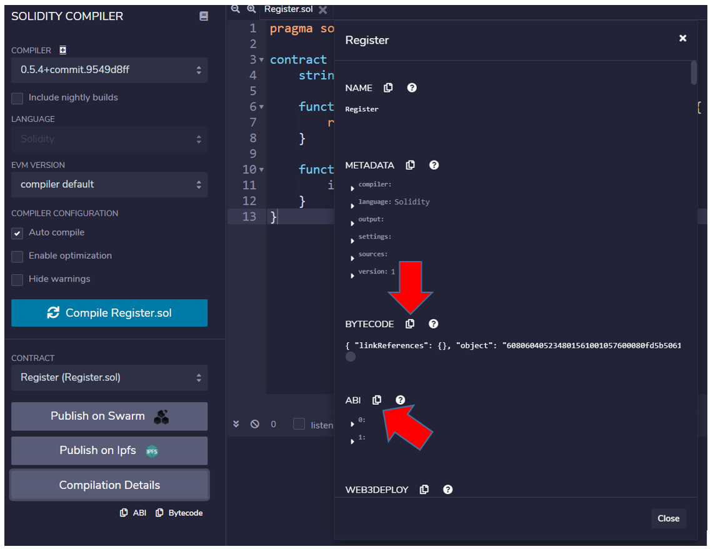
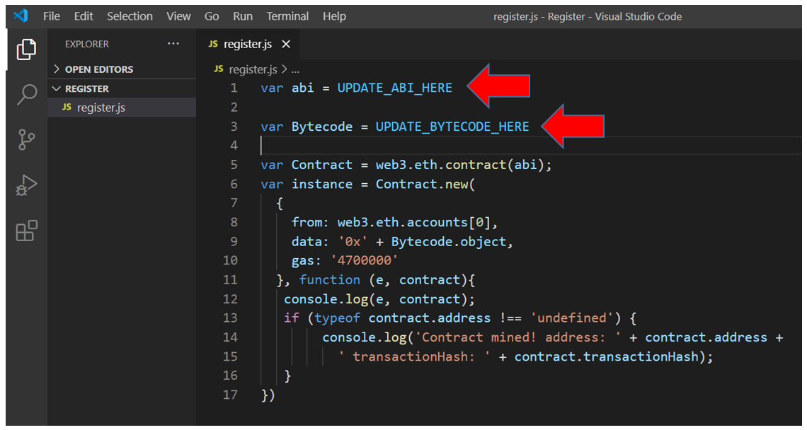
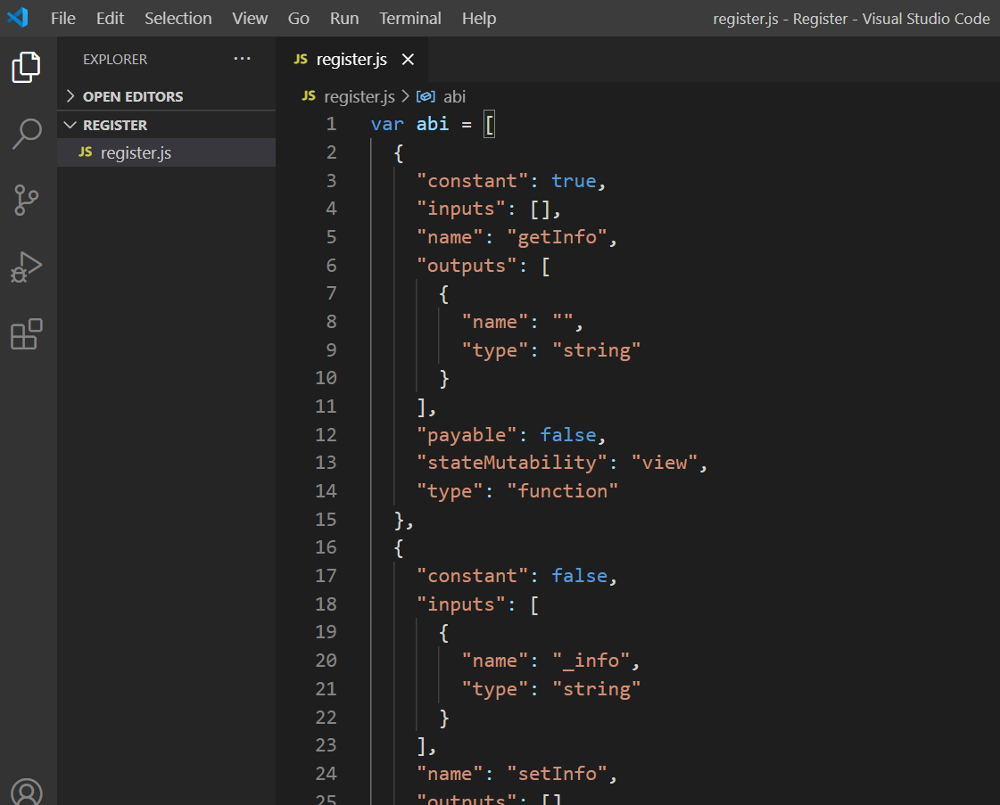
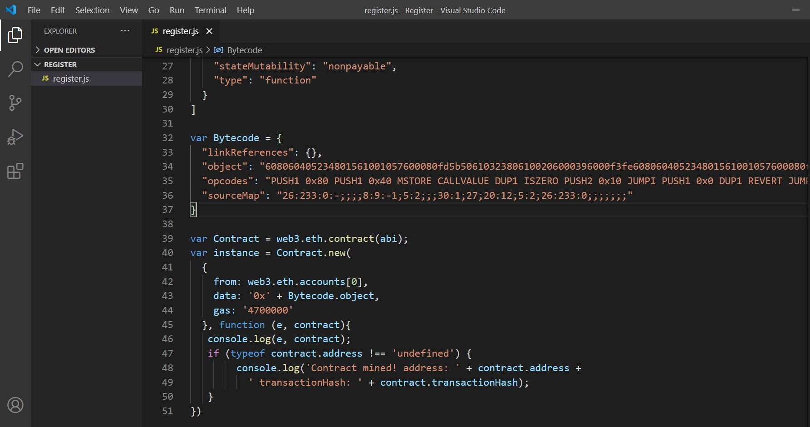

# Create a Javascript file to deploy a smart contract in Geth console

I always used Remix feature `web3Deploy` to generate a script to deploy a smart contract in Geth console.
But the last time I tried (oct/2020) Remix was updated the web3js version and Geth didn't do the same.
Currently Remix generates a script to deploy a smart contract using web3js > 1.0.

The older web3js (<= 1.0) has a different way to deploy a smart contract using javascript.
Until some time ago, Remix used this ancient version, which could run succefully in Geth console.

Geth console still uses an old web3.js (<= 1.0), so, to do this now, you still can use the information generated by Remix, but you need to create an ancient script. 
This [issue in Github](https://github.com/ethereum/go-ethereum/issues/21016) is related to this subject.

> [!NOTE]
> I'm using Geth version 1.9.24 in this tutorial.

## Requirements 

1. Create a smart contract

I'm using the smart contract `Register`, built in [create a smart contract](/en/remix/remix-create.md).

2. Compile the smart contract `Register`

If you need help, go to [compile a smart contract](/en/remix/remix-compile.md).

## Creating the Javascript file 

In the editor of your choice, create the file `register.js`.

I also created a folder called `Register` to place this file in.

I am using Windows OS, and the full path of my file is:

```shell
C:\ETH\Register\register.js
```



Update your file with this template:

```javascript
var abi = UPDATE_ABI_HERE

var Bytecode = UPDATE_BYTECODE_HERE

var Contract = web3.eth.contract(abi);
var instance = Contract.new(
  {
    from: web3.eth.accounts[0], 
    data: '0x' + Bytecode.object, 
    gas: '4700000'
  }, function (e, contract){
   console.log(e, contract);
   if (typeof contract.address !== 'undefined') {
        console.log('Contract mined! address: ' + contract.address + 
          ' transactionHash: ' + contract.transactionHash);
   }
})
```



## Renaming variables

1. The smart contract is named `Register`, so substitute `Contract` with `Register` in lines 5 and 6.
2. The instance will be `register`, so replace `instance` with `register` in line 6.



## Compilation Details

Switch back to Remix.

Solidity compiler screen has a button at the left side botton called `Compilation Details`:



> [!TIP]
> If the `Compilation Details` button isn't showing, you need to compile the smart contract.

It will open a pop up window, which has some useful information.
Scroll down until you find `ABI` and `BYTECODE`. 



Copy the `ABI` and paste in `register.js` file, replacing the expression `UPDATE_ABI_HERE`.



Do the same for `BYTECODE`, 
copy the `BYTECODE` from `Compilation Details` and paste in `register.js` file, replacing the expression `UPDATE_BYTECODE_HERE`.

Take a look in an excerpt of `ABI`:



Also you can see the `BYTECODE`:



Save the file.

> [!ATTENTION]
> This script works in Geth 
> only using Solidity version <= 0.5.4

## Deploy in Geth

The Javascript file is ready for use in Geth to deploy the Register smart contract!
:tada:

Go to [deploy a smart contract at local node using Geth and Remix](/en/geth/geth-deployweb3-remix-js.md) to learn how to do it.

:sun_with_face:
