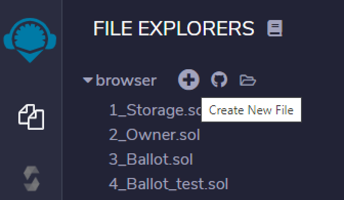
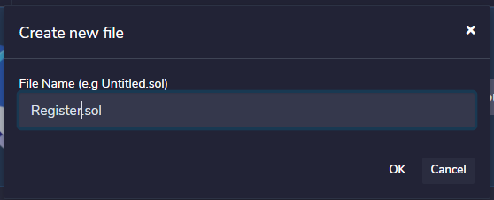
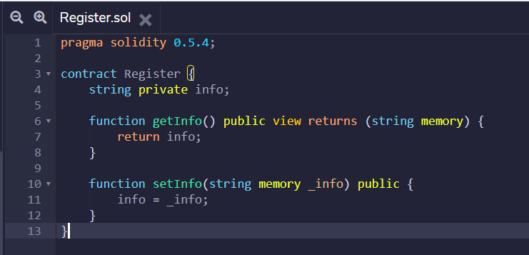

## Creating the smart contract Register

Click on symbol `+` - create a new file.



File name: `Register.sol`



Copy this smart contract:

```solidity
pragma solidity 0.5.4;

contract Register {
    string private info;
    
    function getInfo() public view returns (string memory) {
        return info;
    }
    
    function setInfo(string memory _info) public {
        info = _info;
    }
}
```

Paste it into Remix, here:



### Register.sol

This smart contract has:

* A variable `info` to store a string
* A function `getInfo()` to return the string stored at variable info
* A function `setInfo()` to change the string stored at variable info


