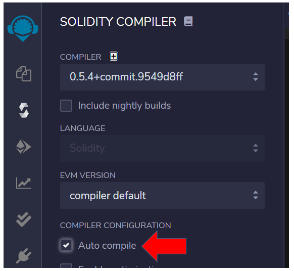

# Remix

Remix is an online web tool. It is an IDE (Integrated Development Environment) used to write, compile, publish and debug Solidity code. 
It can be connected to a web wallet, such as Metamask, and, through this connection, be used to deploy smart contracts on different networks.

Can be accessed at 
[remix.ethereum.org](http://remix.ethereum.org/)

## Environment Solidity

In the `home page`, choose environment `Solidity`

## Terminal

On Remix, at the bottom right, there is a terminal with some libraries available.

You can send commands and transactions here. 
It also presents the result of transactions and / or calls to smart contract functions.

> [!NOTE]
> This return area is very important to follow the results!

## Solidity compiler

In the 3rd button at left side click on Solidity compiler.

It is useful to enable auto-compile, it'll compile smart contracts automatically when editing in Remix.

## Deploy and run transactions

In the left side panel, go to the button `Deploy and run transactions`. 
Actually, it is the 4th button.

Remix has the `JavaScriptVM` environment, a Blockchain simulator that takes place in the browser memory.

## Accounts
This simulator has several addresses / accounts with fictitious Ethers that we can choose to publish a smart contract or interact with it.

Here is an example of an accounts list:

Each time you start Remix or refresh the page, the list of accounts may change.

## Smart contracts

Smart contracts are located on the 2nd button on the left side: `file explorers`

