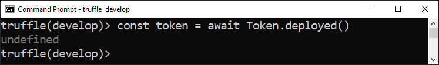
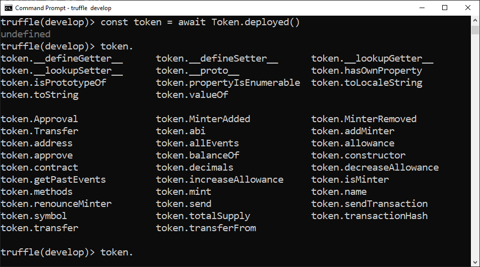
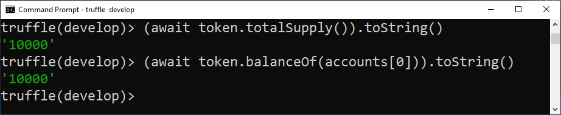
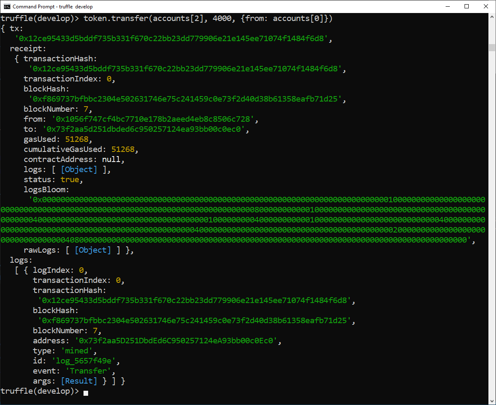
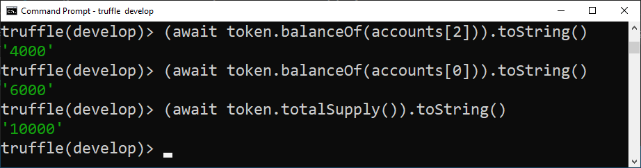

# Using Truffle Sol token box

Token contracts are most frequently used to exchange or store value.
In this tutorial, I will show you step-by-step how to use the Truffle box [sol-token-box](https://github.com/solangegueiros/sol-token-box), 
which comes with everything you need to create an [ERC20](https://eips.ethereum.org/EIPS/eip-20) standard token. 
It includes network configuration for deploy on [Görli testnet](https://goerli.net/) network and a mintable ERC20 token.

## Overview

Here is a summary of the steps we will take in this tutorial:

1. [Setup prerequisites](#setup-prerequisites);
2. [Install Sol Token Box](#install-sol-token-box);
3. [Understand the smart contract](#tokensol)
4. [Learn how to use the Truffle development console](#truffle-development-console);
5. [Compile token.sol](#compile-a-smart-contract);
6. [Deploy the smart contract](#deploy-a-smart-contract);
7. [Run tests](#test-a-smart-contract);
8. [Interact with a smart contract in development console](#interact-with-the-token-in-development-console);
9. [Deploy on Blockchain](#deploy-on-blockchain);
10. [Check the connection on network](#check-the-connection-on-network);
11. [Deploy on Goerli testnet](#deploy-on-goerli-testnet);
12. [Interact with the token on Goerli network](#interact-with-the-token-on-gorli-network);
13. [Using the token in Metamask](#using-the-token-in-metamask);

If you were redirected from the 
[Truffle sol-token-box](https://github.com/solangegueiros/sol-token-box) 
page and successfully executed all the instructions, 
you can go ahead and interact with the published smart contract:

- [In the Truffle development console](#interact-with-the-token-in-development-console)
- [On Goerli network](#interact-with-the-token-on-gorli-network)
- [Using the token in Metamask](#using-the-token-in-metamask)

On the other hand, 
if you would like to review the steps with more explanatory details and images, 
you would find this tutorial helpful.

## Setup prerequisites

[truffle-box-prerequisites-content](truffle-box-prerequisites-content.md ':include')

## Install Sol Token Box

The `truffle unbox` command sets up a project based on a known template. 
In this tutorial, we will be using the **Sol token box** Truffle box, 
which comes with everything you need to create an ERC20 token with less than 15 code lines 
using Open Zeppelin smart contracts library and publish on Görli testnet network.

### Create a new folder

For example, create the folder `my-token`.

```shell
mkdir my-token
```

Navigate to the folder in the terminal.

```shell
cd my-token
```

### Run the unbox command

The truffle unbox command will install all necessary dependencies in the project.

```shell
truffle unbox solangegueiros/sol-token-box
```

This is the result using Windows OS:


### Token.sol

Take a look at the smart contract `Token.sol`. 
You can check it out in folder `contracts`.

```solidity
// SPDX-License-Identifier: MIT
pragma solidity 0.8.4;

import '@openzeppelin/contracts/token/ERC20/ERC20.sol';

contract Token is ERC20  {

    constructor(uint256 initialSupply) ERC20("My token", "MTO") {
        _mint(msg.sender, initialSupply);
    }

    function decimals() public pure override returns (uint8) {
        return 2;
    }
}

```

> [!TIP]
> Token.sol has only 15 code lines!


This smart contract is a mintable [ERC20](https://eips.ethereum.org/EIPS/eip-20) token. 
This means that, in addition to the standard ERC20 specification, it has a function for issuing new tokens.

To create our ERC20 Token, we will import `ERC20Mintable` from [Open Zeppelin contracts](https://openzeppelin.com/contracts/). 
This library itself imports several other libraries such as `SafeMath.sol`, 
the standards for this kind of token, and the capability to mint tokens.

Inside the token, we define some basic information about the token: `name`, `symbol`, and number of `decimals` for the precision.

To inherit the library's attributes and functions, we simply define our contract as a `ERC20Mintable` using the `is` keyword.

## Truffle development console

[truffle-development-console-content](truffle-development-console-content.md ':include')

## Compile a smart contract

In the Truffle console, run this command:

```javascript
compile
```


## Deploy a smart contract

[truffle-deploy-content](truffle-deploy-content.md ':include')

Take a look in the file `2_deploy_contracts.js` located in the `migrations` folder. 


### Migrate

In the Truffle console, run this command:

```javascript
migrate
```

And the `migrate output` should be similar to:


## Test a smart contract

[truffle-test-content](truffle-test-content.md ':include')

Our box also comes with the file `TestToken.js` for testing the smart contract. 
You can check it out in the `test` folder.

Take a look at this `TestToken.js`'s excerpt:


Running the tests:

```javascript
test
```


## Artifacts: Token.json

[truffle-artifacts-content](truffle-artifacts-content.md ':include')

The file `Token.json` is located in the folder `build\contracts\`, by default.

Networks on Token.json


ABI on Token.json


## Interact with the token in development console

The next commands will run inside the development console. 
Go to:

```shell
truffle develop
```

> [!ATTENTION]
> Make sure you deploy the smart contract before executing this part.

### Get your accounts 

[truffle-console-accounts](truffle-console-accounts.md ':include')


### Connect with a published Token contract

First of all, connect with your token:

```javascript
const token = await Token.deployed()
```

Now `token` variable contains an instance of the previously deployed contract.



> [!TIP]
> Don't worry about the `undefined` return, it is ok. 

### Confirm if the token's instance is OK.

Enter the instance's name:  `token`, then type `.` (dot), without space hit the <kbd>&#8677;</kbd> TAB key twice to trigger auto-complete as seen below. 
This will display the published address of the smart contract, and the transaction hash for its deployment, among other things, including all public variables and methods available.

```javascript
token. [TAB] [TAB]
```



### Check the total supply

To check if we have tokens already minted, call the `totalSupply` function:

```javascript
(await token.totalSupply()).toString()
```

The returned value is 10000 = 100.00, it was the amount defined on the smart contract deploy.

### Check the token balance

To check the balance of an account, call the `balanceOf` function. For example, to check the balance of account 0:

```javascript
(await token.balanceOf(accounts[0])).toString()
```

For account 0, the returned value is equal to the total supply because on deploy the smart contract minted tokens for the account who did the action, so, it is the account 0.

Take a look in the results of total supply and balanceOf:



### Transfer tokens

Let's transfer 40 tokens from the first account (`accounts[0]`) to the third account (`accounts[2]`). 
This can be done by calling the `transfer` function.

```javascript
token.transfer(accounts[2], 4000, {from: accounts[0]})
```



**What's happen after the transfer?**

- accounts[2] had no tokens before the transfer, and now it should have 40. 
- accounts[0] will have 60 tokens. 
- also the total supply must be the same.

Let’s check the balance of each account and the total supply.

- Balance of accounts[2]:

```javascript
(await token.balanceOf(accounts[2])).toString()
```

- Balance of accounts[0]:

```javascript
(await token.balanceOf(accounts[0])).toString()
```

- Total supply, one more time:

```javascript
(await token.totalSupply()).toString()
```

Take a look in the results:



Great! The balances of both accounts and the total supply are correct.


### Exit Truffle console

In the Truffle console, enter this command to exit the terminal:

```shell
.exit
```

## Deploy on Blockchain

Let's now switch to interacting with a "real" blockchain,
which is running on multiple nodes distributed around the world, 
across multiple computers!

We need to do some tasks:

- Setup an account / create a wallet
- Update .secret
- Get ETHs
- Connect to a network
- Check the connection on the network
- Deploy in the network of your choice

### Create a wallet

[wallet-create-content](../wallets/wallet-create-content.md ':include')

### Görli testnet

[metamask-goerli](../wallets/metamask-goerli.md ':include')

### Update .secret file

[secret-update](../wallets/secret-update.md ':include')

### Get ETHs on Görli testnet

You can get more explanations on how to do it in 
[Görli](/en/wallets/goerli.md) page.

[truffle-console-goerli](truffle-console-goerli.md ':include')

## Check the connection on the network

[truffle-console-connection](truffle-console-connection.md ':include')

### Check balance

[truffle-console-balance](truffle-console-balance.md ':include')

To exit the Truffle console:

```shell
.exit
```

## Deploy on Gorli testnet

[truffle-migrate-content](truffle-migrate-content.md ':include')

### Migrate on Görli network

Run this command in a terminal (not in Truffle console):

```shell
truffle migrate --network goerli
```

> [!TIP]
> The migrate process in a real blockchain takes some time, 
> because Truffle create some transactions which need to be mined and included in the blocks.


Congratulations!
:tada:

The token is now published in the blockchain.

> [!ATTENTION]
> Make sure you have enough funds to deploy it. 

Copy and save the token address. You will use it later.

For example, in the migrate above, the token address is [0x41Ae8F2E2133d95196Af7E89a75655346567d107](https://goerli.etherscan.io/address/0x41Ae8F2E2133d95196Af7E89a75655346567d107).

You can verify it in [Etherscan - Goerli explorer](https://goerli.etherscan.io/address/0x41Ae8F2E2133d95196Af7E89a75655346567d107).


## Interact with the token on Gorli network

Interact with the smart contract using Truffle console connected to the network. 
It's the same as we did for Truffle development console, but now it will be for a real blockchain!

> [!ATTENTION]
> Make sure you had deployed the smart contract before executing this part.

Do the same steps which was done before:

- Open Truffle console connected to the network which you deploy the token
- Get your accounts
- Connect with your token
- Check the total supply
- Get the token balance
- Transfer tokens


## Using the token in Metamask

You can check the balance or send tokens using Metamask, the previously installed web3 wallet injected in the browser.

Go to the tutorial 
[using a custom token in Metamask](/en/wallets/metamask-custom-token.md).


## Final considerations

In this tutorial you learned how to use the Truffle box [sol-token-box](https://github.com/solangegueiros/sol-token-box)
to create your own ERC20 token using Open Zeppelin smart contracts library in Truffle framework, connected to Goerli testnet network.

I hope this tutorial has been helpful and I'd appreciate your feedback. 
Share it if you like it :)

:sun_with_face:
