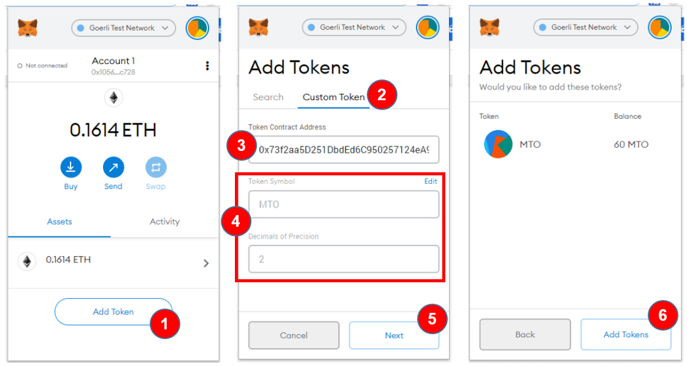
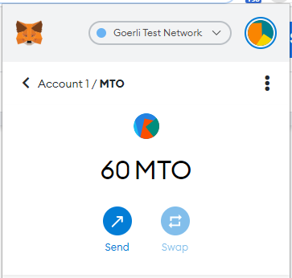

1. Click the button `Add Token`
2. Go to the tab `Custom Token`
3. Paste the token address
4. Check if the Token symbol and decimals of precision are correct
5. Click the button `Next`
6. Click the button `Add Tokens`

I used the address [0x73f2aa5D251DbdEd6C950257124eA93bb00c0Ec0](https://goerli.etherscan.io/address/0x73f2aa5d251dbded6c950257124ea93bb00c0ec0).

It is the token created in the step 
[deploy-on-goerli-testnet - Sol token box](/en/truffle/box-token?id=deploy-on-goerli-testnet).

The token's address can be different because I created the token many times 
:smile:

You can realize that I have 60 tokens, 
which was the balance of `accounts[0]` after last transfer, in
[interact with the token on the network - Sol token box](/en/truffle/box-token?id=interact-with-the-token-on-gorli-network).

