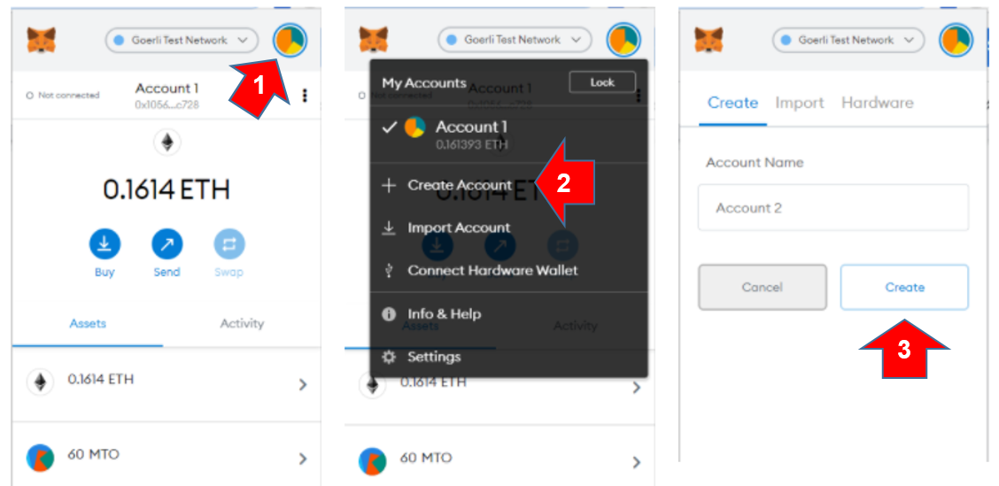
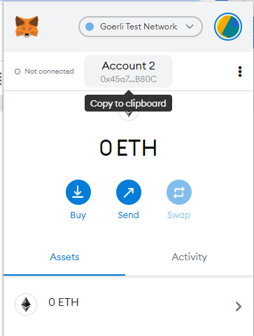
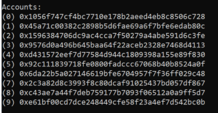

I have the default account in Metamask and I would like to create the second account.

1. Click colored circle located above, on the right side
2. Choose `Create account`
3. Click the button `Create`

To copy the address of account 2 in Metamask, click on the `Account 2`

For example, using my mnemonic, account 2 is `0x45a71c00382C2898b5d6Fae69A6F7bfE6EDAB80C`

It was created the next account in the web wallet, which must be the same that was listed using Truffle console, in [interact with the token on the network - Sol token box](/en/truffle/box-token?id=interact-with-the-token-on-gorli-network).

> [!TIP]
> The account's array in Truffle console is zero base indexed, but the web wallet start in account 1. 
> So the second account (account 2) in the web wallet is the accounts[1] in Truffle console.

