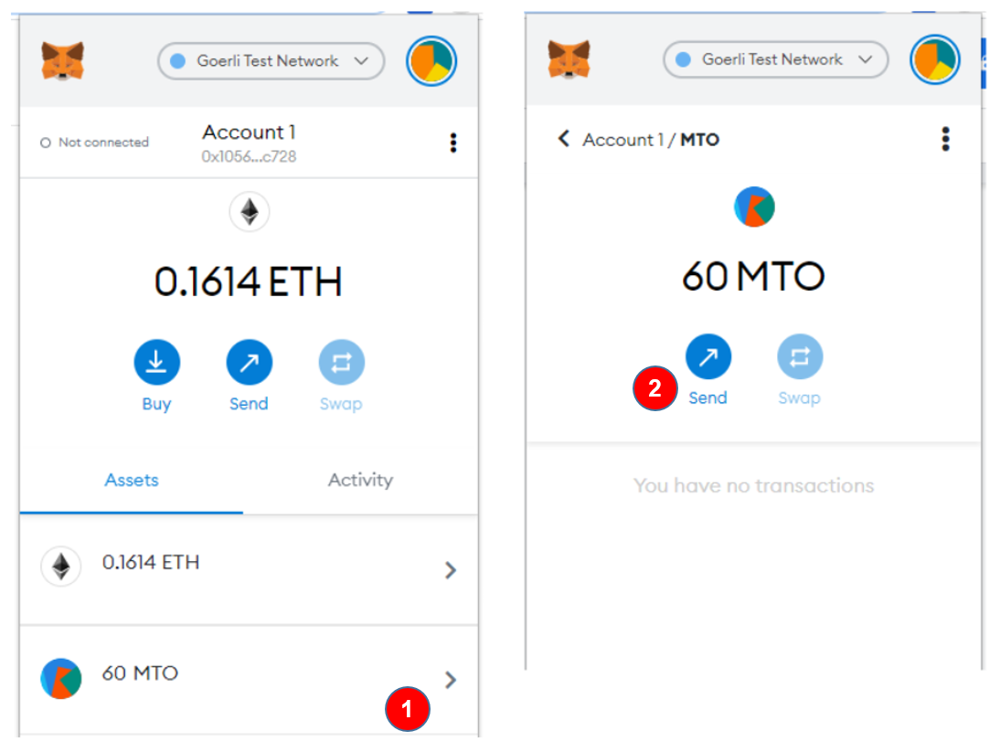
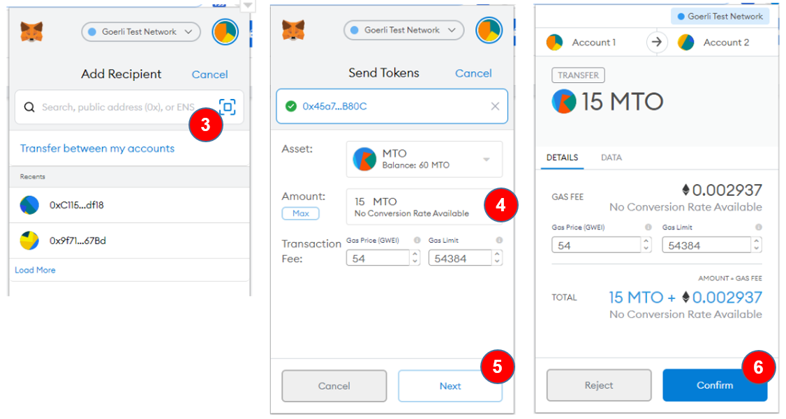
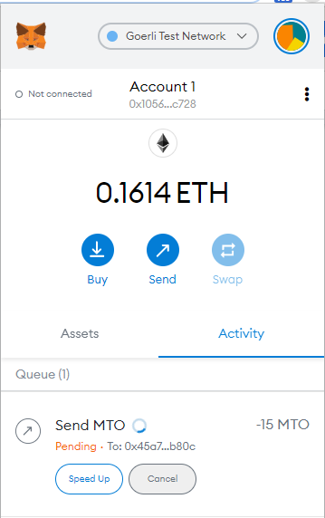
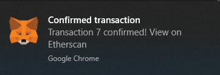
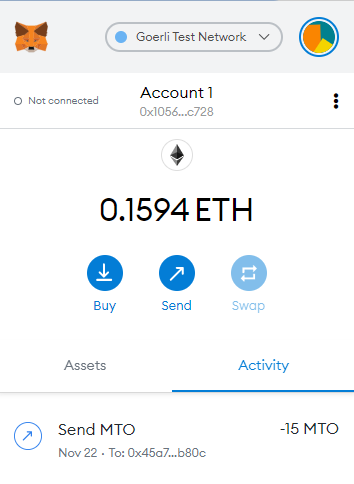
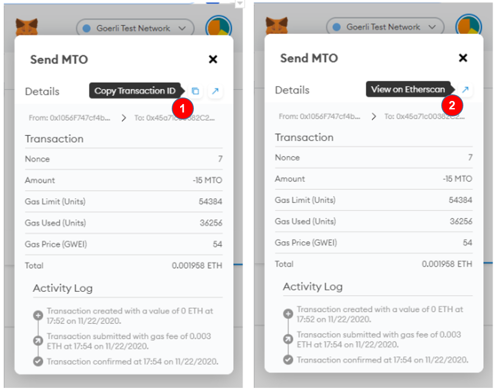
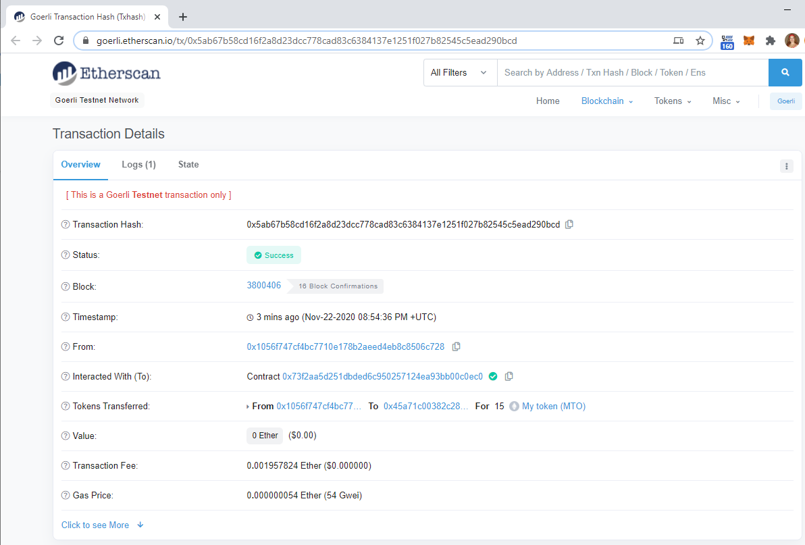
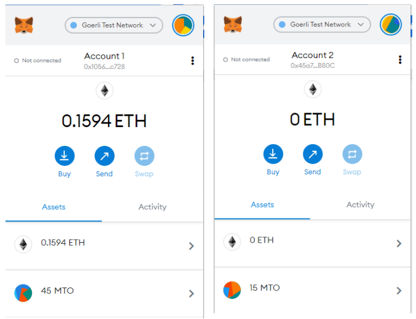

Select the first account in Metamask.
Click colored circle located above, on the right side, to change the account.

Let's transfer 15 tokens from account 1 to account 2.

1. Click `>` at right side of the token (not in ETH).
2. Click `Send`

3. Paste the address of account 2, which was copied previously
4. Fill the Amount: `15.00`
5. Click the button `Next`
6. Click the button `Confirm`, to confirm the transaction

Wait some seconds, the balances will change when the transaction was mined!

Click the transaction to check it out the details:

1. copy the Transaction ID
or 
2. view on Etherscan

In my example, the transaction ID is [0x5ab67b58cd16f2a8d23dcc778cad83c6384137e1251f027b82545c5ead290bcd](https://goerli.etherscan.io/tx/0x5ab67b58cd16f2a8d23dcc778cad83c6384137e1251f027b82545c5ead290bcd)

In the asset's tab, you can realize that the account 1 has 15 tokens less, 
and the account 2 now has 15 MTOs!

