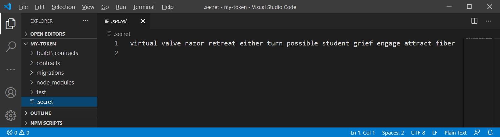
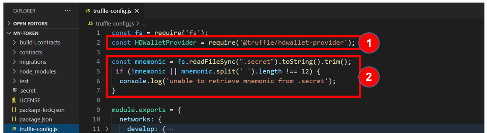

Update your mnemonic in the `.secret` file, 
located in the project's folder, and save it.

Take a look at the `truffle-config.js` file to realize that we are:
1. using `HDWalletProvider`
2. loading the mnemonic from the `.secret` file.

