# Geth JavaScript Console

Geth tiene una consola JavaScript console que se puede usar en un nodo Geth para enviarle algunos comandos.

#### Geth console

El subcomando `console` inicia el nodo geth y luego abre la consola en la misma ventana.

#### Geth attach

El subcomando `attach` se adjunta la consola a una instancia geth que ya se está ejecutando en otra ventana.

Aprenda más: [Geth javascriptconsole](https://geth.ethereum.org/docs/interface/javascript-console)

## Geth with IPC - Geth attach

Mostraré cómo usar Geth attach para conectarse a un nodo local Geth que ya se está ejecutando y ejecutar algunos comandos dentro de él.

> [!NOTE]
> Se puede usar para cualquier nodo Geth, pero aquí lo haré conectado a un nodo local Geth.

## Ejecutando el nodo Geth

En primer lugar, debe tener Geth ejecutándose en otra ventana de terminal.

Ve a [Nodo local Geth](./es/geth/geth-local-node.md) para obtener ayuda.

## Geth attach con IPC

Abra una segunda ventana de terminal.

Puede conectarse en cualquier carpeta, pero, si tiene algunos archivos javascripts para ejecutar, es mejor hacer el attach en la carpeta del proyecto.

Por ejemplo, lo haré en la ubicación `C:\ETH\Register`.

La ruta de IPC se puede obtener cuando se ejecuta el nodo, compruébelo en [Ruta de IPC](./es/geth/geth-local-node?#ruta-de-ipc ':target=_blank')

```
geth attach ipc:\\.\pipe\geth.ipc
```

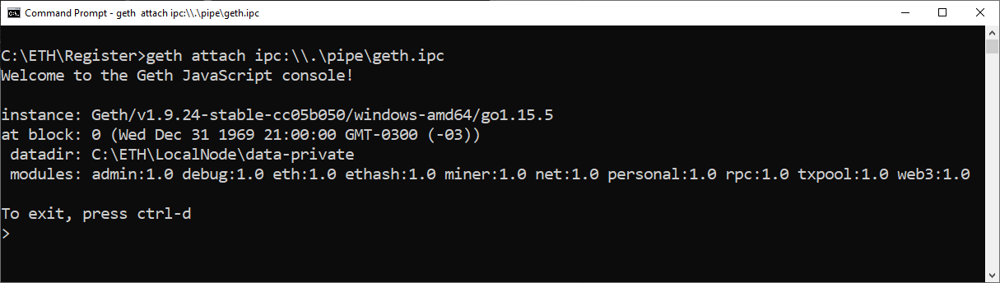

> [!WARNING]
> Este procedimiento es solo para un nodo que se ejecuta en su máquina o en una red a la que tiene acceso.
> Geth attach te da el control total de la instancia remota, así que no esperes que alguien más te dé ese acceso a su máquina.
> 
## Consejos especiales

### Copiar y pegar en terminales con SO Windows

En la consola de Geth, para pegar algo que copió de otro lugar, use:

- Botón derecho
- Flecha correcta <kbd>&rarr;</kbd>

No presione ambas teclas al mismo tiempo, sino en secuencia: primero "Botón derecho", luego "Flecha derecha".

### Lista de comandos

Un consejo para enumerar los comandos disponibles. Presione 2 espacios y la tecla TAB <kbd>&#8677;</kbd> dos veces.
Este es el resultado:

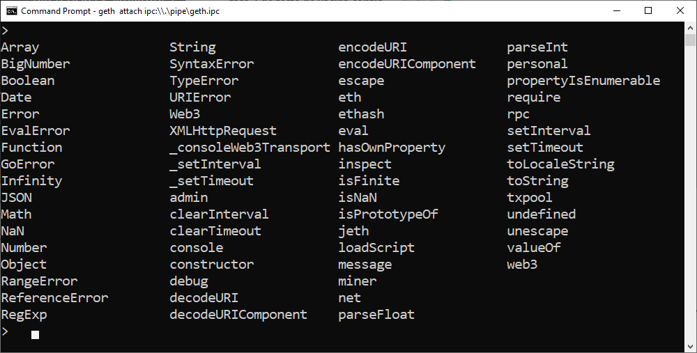

## Personal and Accounts

Enumere todo lo relacionado con las cuentas en su nodo local.

```js
personal
```

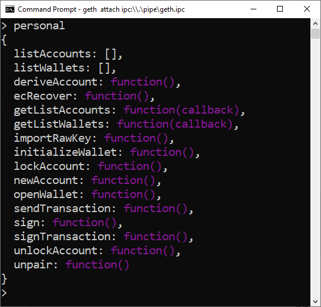

Más información sobre [cuentas](https://geth.ethereum.org/docs/interface/managing-your-accounts)

### List Accounts

Puede enumerar solo las cuentas:

```js
personal.listAccounts
```

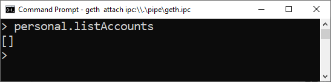

Este otro comando hace lo mismo:

```js
eth.accounts
```

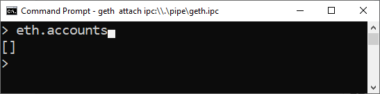

### Create account

Cría una nueva cuenta:

```js
personal.newAccount("mypass")
```

> [!WARNING]
> Es importante guardar o recordar su contraseña, ya que se utiliza para cifrar su clave privada en la computadora.
>
> En el ejemplo, la contraseña es `mypass`.

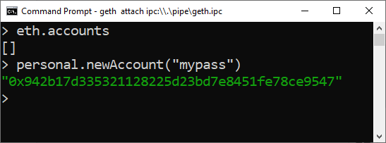

Esta es la dirección o clave pública de mi nueva cuenta: 
`0x942b17d335321128225d23bd7e8451fe78ce9547`

Ejecuta el comando `personal` nuevamente:

```js
personal
```

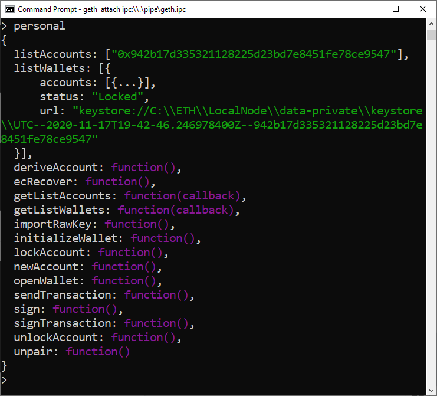

Encontrarás una cuenta en `listAccounts`.

### Cría otra cuenta

Crearemos una segunda cuenta, que será `account[1]`.

> [!NOTE]
> La lista de cuentas se basa en cero, entonces la segunda cuenta es `account[1]`.

```js
personal.newAccount("mypass")
```

La `account[1]` es
`0xcc15531a75a9cca4e6da0ba5d36b70e253963bd5`

Run the list accounts command again:

```js
personal.listAccounts
```

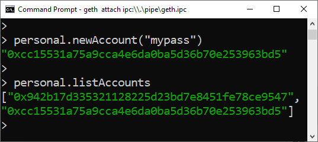

## Mineria

Empieza la mineria

```js
miner.start(1)
```

Deten la mineria

```js
miner.stop()
```

Aprenda más sobre [mining](https://geth.ethereum.org/docs/interface/mining) 

## Saldos

Para conocer el saldo de una cuenta, por ejemplo, `account[0]`:

```js
eth.getBalance(eth.accounts[0])
```

Obtuvimos un gran número porque el resultado se presenta en wei. Podemos convertir a Ether:

```js
web3.fromWei(eth.getBalance(eth.accounts[0]),"ether")
```

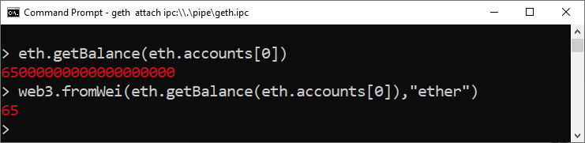

### Saldo de una cuenta específica

Me gustaría verificar el saldo de una cuenta usando la dirección, como `0x942b17d335321128225d23bd7e8451fe78ce9547` que creé antes:

```js
web3.fromWei(eth.getBalance("0x942b17d335321128225d23bd7e8451fe78ce9547"),"ether")
```

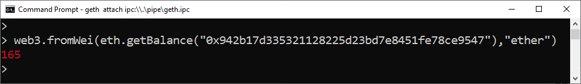

## Desbloqueando una cuenta

Antes de enviar una transacción desde una cuenta, debe desbloquearla para gastar los fondos almacenados en ella.

```js
personal.unlockAccount(eth.accounts[0], "mypass", 0)
```

Los parámetros son:
1. la cuenta que se desbloqueará: eth.accounts [0]
2. la contraseña para esta cuenta: `mypass`
3. duración para que expire el desbloqueo. La duración predeterminada es de 300 segundos. Un 0 explícito en el parámetro de duración desbloquea la cuenta mientras la consola Geth está abierta (hasta salir de la consola Geth).

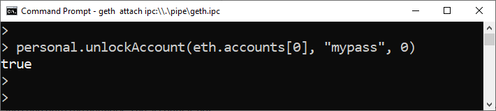

## Transferindo Ethers

Me gustaría transferir 20 Ethers de `accounts[0]` a `accounts[1]`:

```js
eth.sendTransaction({from:eth.accounts[0], to:eth.accounts[1], value: web3.toWei(20, "ether")})
```

¡Perfecto! Obtuve un hash de transacción. Esto significa que mi transacción se envió a Blockchain y se incluirá en un bloque en unos segundos.

Ahora verificaré el saldo de `accounts[1]`:

```js
web3.fromWei(eth.getBalance(eth.accounts[1]),"ether")
```

Y el resultado es:

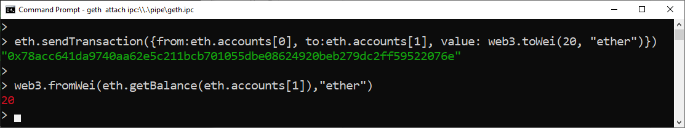

:tada: 

`accounts[1]` tiene 20 Ethers!

## Salida de Geth

Para salir de la consola Geth:

```js
exit
```

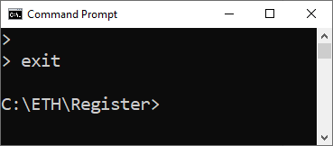

## Consideraciones finales

Espero que haya sido fácil usar Geth, un cliente de Ethereum, para ejecutar e interactuar con un nodo local.

:sun_with_face:
