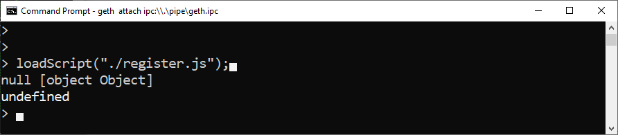
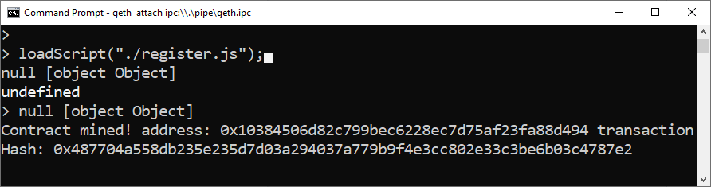
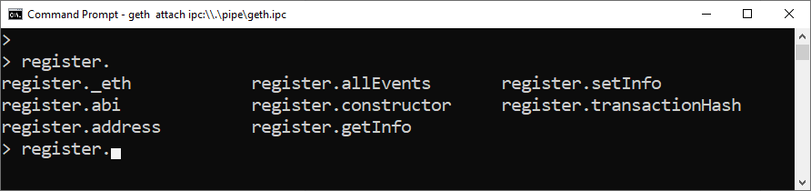
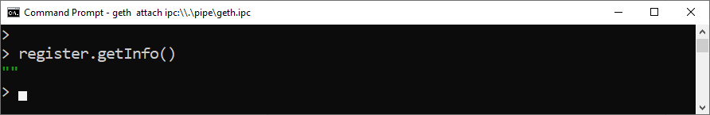
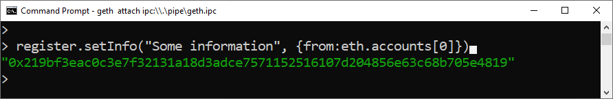
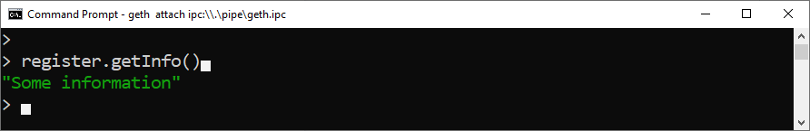

# Implemente un contrato inteligente en el nodo local usando Geth y Remix

En este tutorial, le mostraré paso a paso cómo compilar un contrato inteligente usando Remix e implementarlo en un nodo local usando Geth.

## Requisitos

- Geth
- Remix - web tool, online

### Geth

If you don't have Geth installed, 
go to [Geth install](/es/geth/geth-install.md)

### Remix

Go to 
[remix.ethereum.org](http://remix.ethereum.org/)

## Cría un archivo Javascript para implementar un contrato inteligente en la consola Geth

Primero necesita crear un archivo Javascript con información extraída de Remix.

El tutorial 
[Creando un archivo Javascript para implementar un contrato inteligente en la consola Geth](/es/remix/remix-create-js-deploy-file.md)
explica esta parte.

## Geth attach a tu nodo

Ve a la carpeta donde está el archivo `register.js`.
Por ejemplo, lo guardé en `C:\ETH\Register` en el SO Windows.

```js
cd C:\ETH\Register
```

Ejecute el comando attach:

```js
geth attach ipc:\\.\pipe\geth.ipc
```

Si tiene alguna duda, conozca más sobre el [Geth JavaScript Console](/es/geth/geth-console-attach.md)

## Desbloquea su cuenta

```js
personal.unlockAccount(eth.accounts[0], "mypass", 0)
```

## Implementa el contrato inteligente en la consola Geth

Esto es bastante simple, cargamos el script creado con las ABI y Bytecode generadas en Remix,
`register.js`,
usando el siguiente comando:

```js
loadScript("./register.js");
```

> [!NOTE]
> Incluso si está utilizando el SO Windows, la ruta del archivo debe usar `/` en lugar de `\`.



Una vez que el contrato inteligente se haya validado e incluido en un bloque, recibirá el mensaje "Contract mined!"  - contrato minado.

Por lo general, el símbolo del sistema desaparece después del mensaje de respuesta. Presiona cualquier tecla para mostrarlo nuevamente.



> [!ATTENTION]
> Asegúrese de estar minando, de lo contrario no aparecerá el mensaje "¡Contrato minado!" y el contrato inteligente no se publicará en Blockchain.

## Interactua con el contrato inteligente

Lo primero que debe hacer es verificar si la instancia se fue implementada correctamente.

Escribe el nombre de la instancia (register), presiona "." Y luego presiona TAB <kbd>&#8677;</kbd> dos veces para activar el autocompletado. 
Esto mostrará la dirección publicada, el hash de la transacción de implementación, entre otras cosas, incluidos todos los métodos disponibles.

```js
register. [TAB] [TAB]
```



### getInfo

Devuelve la string almacenada en la variable `info`.

Primero verificaremos si hay algún valor almacenado inmediatamente después de la publicación:

```js
register.getInfo()
```



No tenemos ninguna información almacenada, porque no definimos nada en el `constructor`, que es la función que se llama al publicar el contrato inteligente.

### setInfo

Esta es una función para cambiar la string almacenada en la variable `info`.

Guardemos alguna información en el contrato inteligente invocándola:

```js
register.setInfo("Some information", {from:eth.accounts[0]})
```



Recibimos un hash de transacción porque enviamos una transacción para cambiar el estado del contrato inteligente, que es actualizar el valor de la variable `info`.

### getInfo (again)

Desde que tenemos la string "Some information" guardada, podemos confirmar esto.

Ejecuta la función `getInfo()` nuevamente:

```js
register.getInfo()
```



Y devolvió la info `Some information`.

¡Ahora hemos almacenado información en nuestro contrato inteligente y podemos recuperarla!
:tada: 

:sun_with_face:
