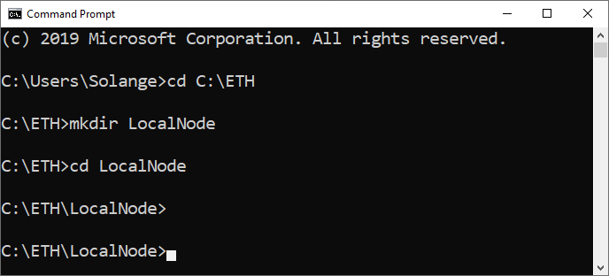
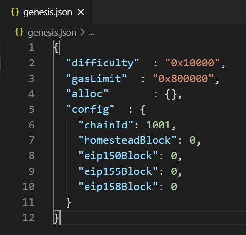
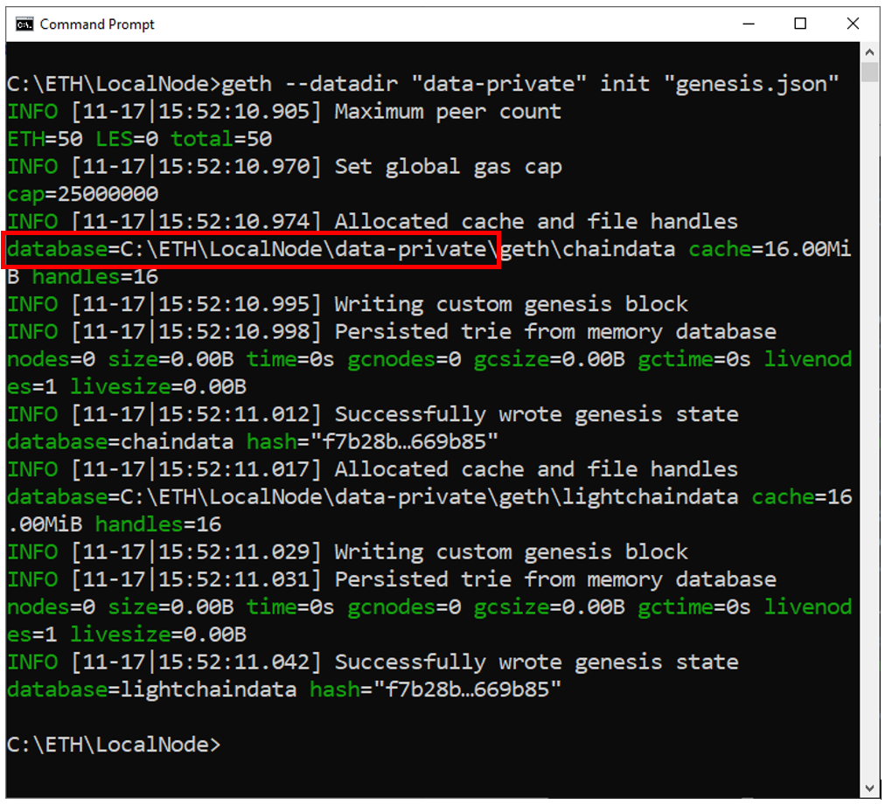
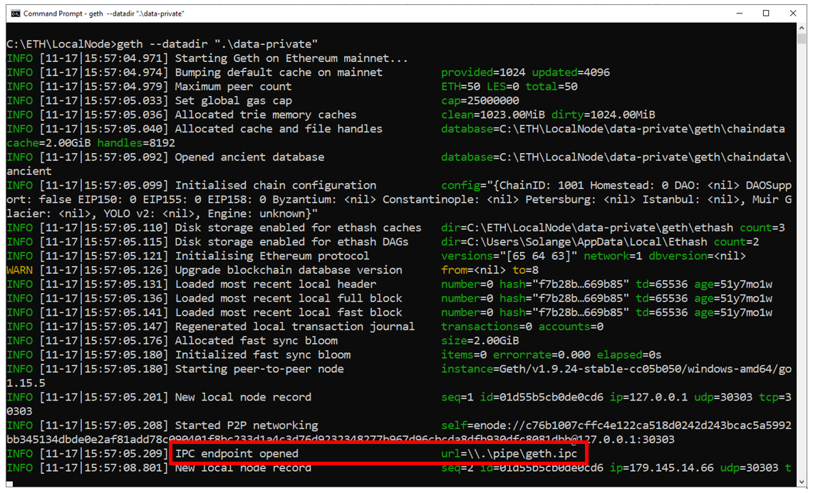
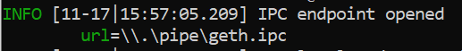

# Geth - creando un nodo local

En este tutorial, te mostraré paso a paso cómo crear un nodo local Ethereum utilizando el cliente Ethereum Geth.

## Descarga e instalación de Geth

Si aún no lo ha hecho, ve a 
[instalación de Geth](/es/geth/geth-install.md)

## Archivo de génesis

1. Cree o elija una carpeta para crear el archivo de génesis.

Lo haré en la carpeta `C:\ETH\LocalNode`.

En la terminal:

```shell
cd C:\ETH
mkdir LocalNode
cd LocalNode
```



2. En el editor de su elección, crea un archivo llamado `genesis.json`.

Copia y pega esta configuración:

```shell
{
	"difficulty"	: "0x10000",
	"gasLimit"  : "0x800000",
	"alloc"     	: {},
	"config"	: {
    "chainId": 1001,
    "homesteadBlock": 0,
    "eip150Block": 0,
    "eip155Block": 0,
    "eip158Block": 0
	}
}
```



## Geth init

Ve a la terminal,
en la carpeta donde creaste el archivo `genesis.json`

Ejecute este comando para inicializar un nuevo Blockchain:

<!-- tabs:start -->

#### ** Linux **

Si está en la carpeta Geth:

```shell
./geth --datadir "/home/eth/data-private"  init "genesis.json"  
```

#### ** Mac OS **

En la carpeta Geth:

```shell
./geth --datadir "/home/eth/data-private"  init "genesis.json"  
```

#### ** Windows OS **

```shell
geth --datadir "data-private" init "genesis.json"  
```

<!-- tabs:end -->

La base de datos del se ubicará en la carpeta `data-private`.



## Ejecutando Geth

```shell
geth --datadir ".\data-private"
```


## Ruta de IPC

La ruta de IPC se utilizará más tarde para conectarse a su nodo, así que anótela.



Mi ruta de IPC es

```shell
\\.\pipe\geth.ipc
```

## Conéctase al nodo Geth usando IPC

Ve a [Geth JavaScript Console](/es/geth/geth-console-attach.md) 
para aprender a usar la consola Javascript para enviar algunos comandos al nodo.

:sun_with_face:
