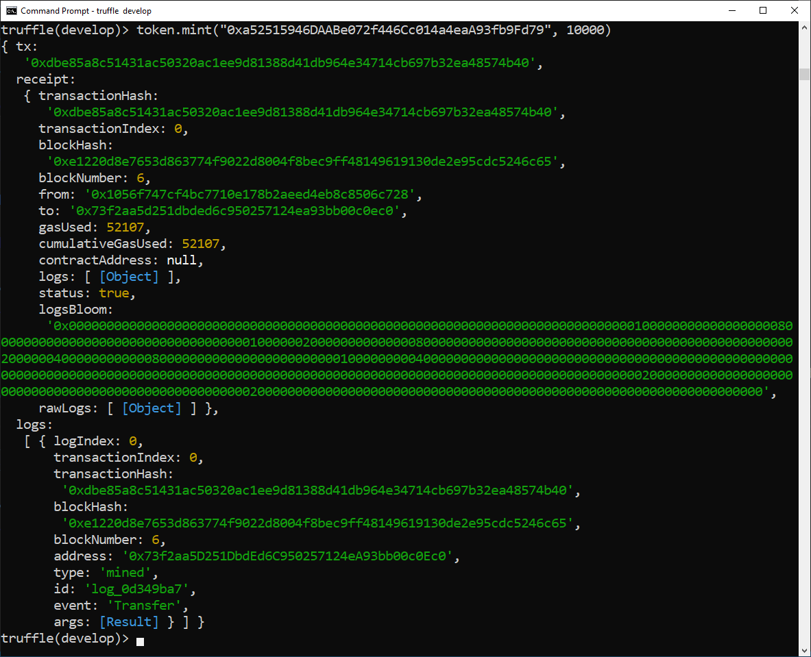

### Conéctate con tu token publicado

En primer lugar, conéctese con su token:

```javascript
const token = await Token.deployed()
```

Ahora la variable `token` contiene una instancia del contrato implementado previamente.


> [!TIP]
> No se preocupe por la devolución `undefined`, es el defecto.

### Confirma si la instancia del token está bien

Ingresa el nombre de la instancia: `token`, luego` .` (punto), sin espacio, presione el botón <kbd>&#8677;</kbd> TAB dos veces para activar la función de autocompletar como se ve a continuación.
 
 Esto mostrará la dirección publicada del contrato inteligente y el hash de la transacción para su implementación, 
 entre otras cosas, incluidas todas las variables públicas y los métodos disponibles.

```javascript
token. [TAB] [TAB]
```


### Verifica el total supply

Para comprobar si ya tenemos tokens acuñados, llama a la función `totalSupply`:

```javascript
(await token.totalSupply()).toString()
```

El valor devuelto es 0, lo que se esperaba, ya que no realizamos ninguna acuñación inicial cuando implementamos el token.

### Consulta el saldo del token

Para ver el saldo de una cuenta, llame a la función `balanceOf`. 
Por ejemplo, para mirar el saldo de la cuenta 0:

```javascript
(await token.balanceOf(accounts[0])).toString()
```

El valor devuelto también es 0, lo que se esperaba, 
ya que no hicimos ninguna acuñación inicial cuando implementamos el token y, por definición, 
ninguna cuenta puede tener ningún token todavía.

Eche un vistazo a los resultados de total supply y balanceOf:


### Emite tokens

Ejecute este comando:

```javascript
token.mint(accounts[0], 10000)
```

Este comando envió una transacción para acuñar 100 tokens, con 2 decimales (00), para la cuenta 0.


También puede acuñar a una dirección específica, `0xa52515946DAABe072f446Cc014a4eaA93fb9Fd79`:

```javascript
token.mint("0xa52515946DAABe072f446Cc014a4eaA93fb9Fd79", 10000)
```



### Mira el saldo del token de nuevo

Vamos a verificar nuevamente el saldo de la cuenta 0:

```javascript
(await token.balanceOf(accounts[0])).toString()
```

El valor devuelto es 10000, que es 100 con 2 decimales de precisión. 
Esto es exactamente lo que esperábamos, ya que emitimos 100 tokens.

Además, puede obtener el saldo de una dirección específica, por ejemplo, `0xa52515946DAABe072f446Cc014a4eaA93fb9Fd79`:

```javascript
(await token.balanceOf("0xa52515946DAABe072f446Cc014a4eaA93fb9Fd79")).toString()
```

Mira los resultados:


### Verifica el total supply de nuevo

Verifique el suministro total nuevamente:

```javascript
(await token.totalSupply()).toString()
```


El valor devuelto es 20000, que es 200 con 2 decimales de precisión.
Después de acuñar 100 fichas para 2 cuentas, ¡es perfecto!

### Haz una transferencia de tokens

Vamos a transferir 40 tokens de la primera cuenta (`accounts[0]`) a la tercera cuenta (`accounts[2]`). 
Esto se puede hacer llamando a la función `transfer`.

```javascript
token.transfer(accounts[2], 4000, {from: accounts[0]})
```


**¿Qué pasa después de la transferencia?**

- accounts[2] no tenía tokens antes de la transferencia y ahora debería tener 40.
- accounts[0] debe tener 60 tokens.
- además, el suministro total será el mismo.

Revisemos el saldo de cada cuenta y el suministro total:

- Saldo de accounts[2]:

```javascript
(await token.balanceOf(accounts[2])).toString()
```

- Saldo de accounts[0]:

```javascript
(await token.balanceOf(accounts[0])).toString()
```

- Total supply, una vez más:

```javascript
(await token.totalSupply()).toString()
```

Mira los resultados:


¡Excelente!
Los saldos de ambas cuentas y el total supply son correctos.
