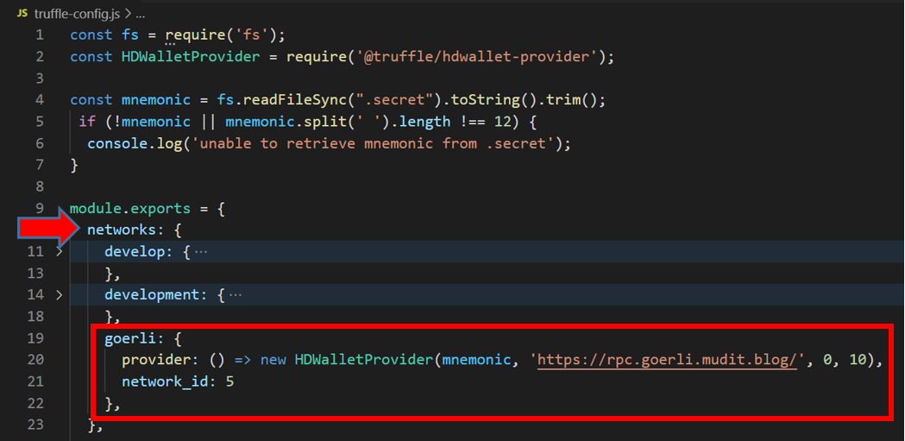
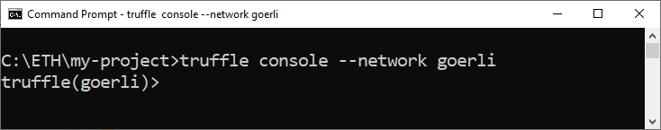
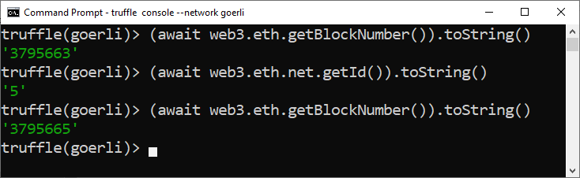

# Creando un proyecto usando Truffle

Hay dos opciones para iniciar un proyecto: 

1. Una plantilla de proyecto vacía
2. Un proyecto basado en un Truffle Box

## 1 - Inicialize un nuevo proyecto Truffle 

Cree un nuevo directorio, `myproject`, por ejemplo, y vaya a la carpeta en la terminal.

```shell
mkdir myproject
cd myproject
```

Por ejemplo, crearé en `C:\ETH\` (estoy usando Windows).

Mi proyecto se ubicará en el directorio `C:\ETH\myproject`.



En la carpeta de su proyecto, inicia un proyecto Truffle:

```shell
truffle init
```



Abre la carpeta en VSCode.
Verás una estructura de directorio como esta:



* `./contracts`: Todos los contratos inteligentes se guardarán en esta carpeta.
* `./migrations`: Los scripts para publicación se almacenarán aquí. 
* `./test`: Aquí se guardarán los scripts de prueba.
* `./truffle-config.js`: Este es el archivo de configuración de Truffle. Aquí configuraremos las redes, incluida RSK.

Tenga en cuenta que también se han creado los siguientes archivos:

* `Migrations.sol`: Smart contract que registra todas las publicaciones realizadas en una red.
* `1_initial_migration.js`: Script para publicación de `Migrations.sol`.

### Inicialize un proyecto npm

Cuando inicializamos un proyecto Truffle desde el template, también necesitamos inicializar un proyecto npm.

Para iniciar un proyecto npm en la carpeta `myproject`, ejecute el siguiente comando en la terminal:


```shell
npm init -y
```


## 2 - Inicialize um proyecto basado en un Truffle Box

> [!WARNING]
> Solo necesita hacer esta parte si no eligió la opción 1.

Truffle Boxes son modelos.
Además de los archivos Truffle,
Truffle Boxes pueden contener otros módulos útiles, como contratos inteligentes Solidity, bibliotecas, páginas front-end y más.

En la opción 1, cuando usamos `truffle init`, estamos usando un tipo especial de Truffle box.

Para crear un proyecto basado en Truffle Box,
Ve a [Truffle boxes](es/truffle/truffle-boxes.md) 

:sun_with_face:
