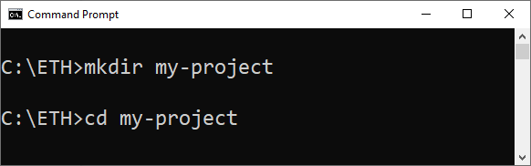
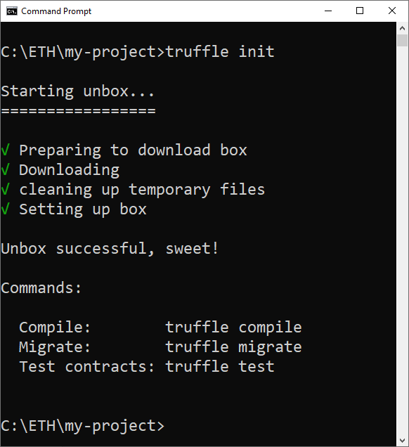
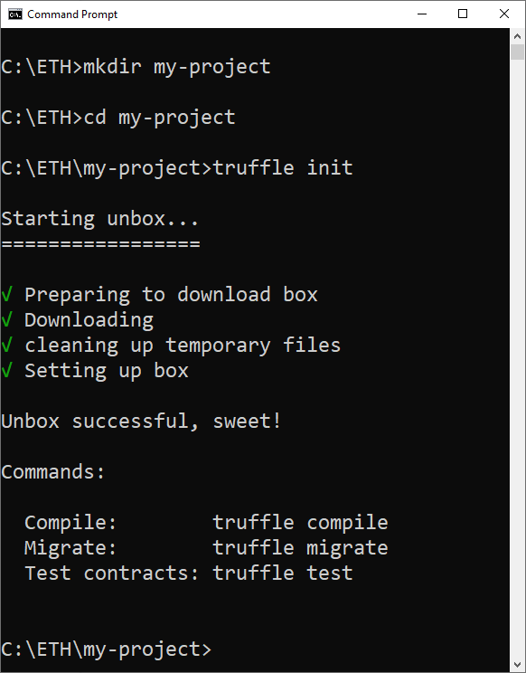
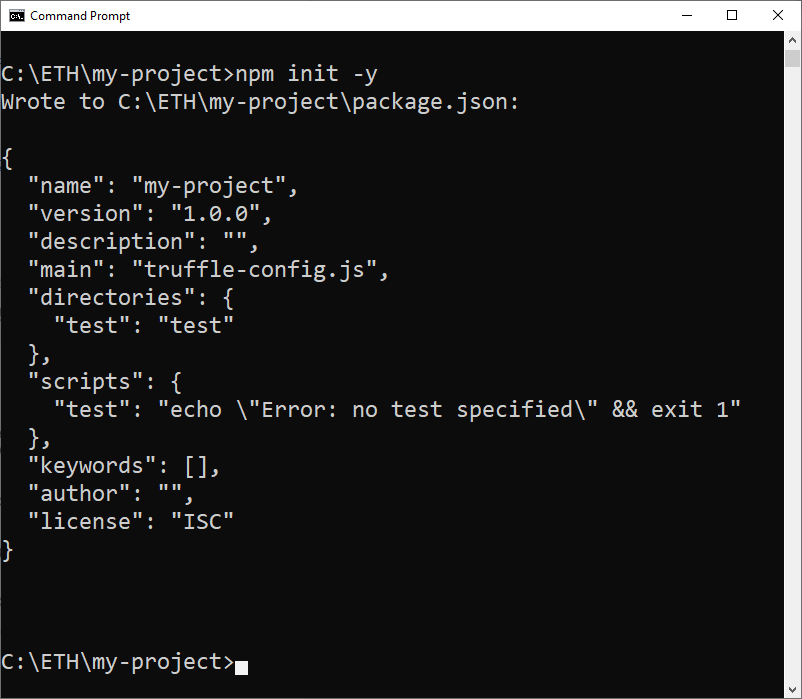
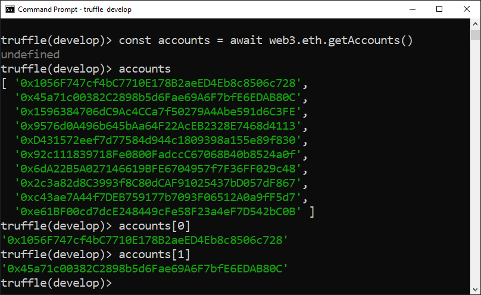

# Requisitos para un proyecto Truffle

Antes de crear un proyecto de Truffle, necesita tener Truffle y otras herramientas útiles instaladas en su computadora.
En este tutorial, le mostraré paso a paso cómo instalar y configurar los requisitos previos para utilizar Truffle Framework.

## Resumen

A continuación, se muestra un resumen de los requisitos de instalación:

1. [Git](#git)
2. [POSIX compliant shell](#posix-compliant-shell)
3. [cURL](#curl)
4. [Node.js and NPM](#nodejs-and-npm)
5. [Code editor](#code-editor)
6. [Truffle framework](#truffle-framework)

## Git

[Git](https://git-scm.com/doc) es un sistema de control de versiones de código abierto. 
Algunos paquetes que instalaremos utilizan Git internamente para descargar las versiones correctas.
Además, tiene algunas utilidades, como `Git Bash`

Quizás Git ya esté instalado. 
Para averiguarlo, abra una terminal e ingrese:

```shell
git --version
```


Hay varias formas de instalar Git.
Compruébalo en el tutorial [Install Git](https://www.atlassian.com/git/tutorials/install-git) (en inglés).

**Windows OS**

Hay otras opciones para Windows:
- [Installer for Windows](https://git-scm.com/download/win).
- [Git for Windows](https://gitforwindows.org/).

## POSIX compliant shell

**Portable Operating System Interface (POSIX)** es una familia de estándares especificados por IEEE Computer Society para mantener la compatibilidad entre sistemas operativos. 
POSIX define la interfaz de programación de aplicaciones (API), junto con shells de línea de comandos e interfaces de utilidad, para la compatibilidad del software con variantes de Unix y otros sistemas operativos. 
Fuente: [Wikipedia](https://en.wikipedia.org/wiki/POSIX)

<!-- tabs:start -->

#### ** Linux **

Usa el terminal estándar

#### ** Mac OS **

Usa el terminal estándar

#### ** Windows OS **

Si usas el terminal estándar `cmd` o PowerShell, es posible que los comandos no funcionen correctamente.

Utiliza el terminal `Git Bash`, instalado junto con `Git` en el paso anterior.

Aquí hay un [Tutorial on installing and using Git Bash](https://www.atlassian.com/git/tutorials/git-bash) (en inglés).

<!-- tabs:end -->

## cURL

Este es un sistema de comando generalmente instalado en tu sistema operativo,
que le permite realizar solicitudes de red, como consultas HTTP,
desde la línea de comando.

Ejecuta el comando `curl --version` y si devuleve un error, 
[descarga curl](https://curl.haxx.se/download.html).

Resultado en OS Windows:



## Node.js and NPM

Otra dependencia es NPM, que se instala con Node.js.

Para comprobar si Node.js y NPM ya están instalados, 
comprueba si los siguientes comandos funcionan en la terminal:


```shell
node --version
npm --version
```

Resultado en OS Windows:



Si no hay un resultado como el anterior, aquí se explica cómo instalarlo en Ubuntu, Mac OSX y Windows.

<!-- tabs:start -->

#### ** Linux **

```shell
sudo apt update
sudo apt install curl git
sudo apt install build-essential # We need this to build native dependencies
curl -sL https://deb.nodesource.com/setup_12.x | sudo -E bash -
sudo apt install nodejs
```

#### ** Mac OS **

```shell
curl -o- https://raw.githubusercontent.com/creationix/nvm/v0.35.2/install.sh | bash
nvm install 12
nvm use 12
nvm alias default 12
npm install npm --global # Upgrade npm to the latest version
```

Asegúrese de tener instalado `node-gyp`:

```shell
npm install -g node-gyp
```

Este próximo paso es necesario para construir dependencias nativas.
Aparecerá una ventana emergente y deberá continuar con la instalación.
Llevará algún tiempo y es posible que se descarguen algunos GB de datos.

```shell
xcode-select --install
```

#### ** Windows OS **

La instalación de Node.js en Windows requiere algunos pasos manuales.

Ve a [Node.js](https://nodejs.org/en/) para descargar e instalarlo.

Installing Node.js on Windows requires a few manual steps.

Go to [Node.js](https://nodejs.org/en/) to download and install it.

Luego [abre tu terminal como Administrador](https://www.howtogeek.com/194041/how-to-open-the-command-prompt-as-administrator-in-windows-8.1/) 

También necesita instalar las herramientas de compilación NPM `Windows Build Tools`

```shell
npm install --global --production windows-build-tools
```

y ejecuta el siguiente comando:

```shell
npm install -g node-gyp
```

<!-- tabs:end -->

### Comentarios sobre Node.js and NPM

NPM generalmente se instala junto con Node.js, por lo que después de instalar Node.js, no es necesario instalarlo por separado.

Si deseas tener más de una versión del Node.js instalada, 
usa el administrador de versiones del Node.js, llamado [nvm](https://github.com/nvm-sh/nvm).

> [!ATTENTION]
> Si ves errores que mencionan "node-gyp", segúrate de haberlo instalado.
 
## Editor de código fuente

Necesitamos algún editor de código, preferiblemente uno que destaque los lenguajes Solidity y Javascript.

[VS Code](https://code.visualstudio.com/)  es una buena opción.

### Visual Studio Code (VS Code)

Para instalarlo, [descárgalo aquí](https://code.visualstudio.com/download).

Comprueba si la instalación del VS Code está bien consultando su versión en el terminal:

```shell
code -v
```



### Extensión VSCode para el lenguaje Solidity

Si usas VSCode, es genial contar con el soporte de Solidity.
Utilizo la extensión para Solidity de [Juan Blanco](https://marketplace.visualstudio.com/items?itemName=JuanBlanco.solidity).

Para instalarla, ve a Extensions (Menu View -> Extensions):

1. Escribe `solidity` en el campo de búsqueda.
2. Selecciona la extensión "solidity" de Juan Blanco.
3. Haz clic en `install`.



## Truffle framework

[Truffle](https://www.trufflesuite.com/truffle) es un framework bien conocido para el desarrollo de contratos inteligentes, que facilita la vida del desarrollador.
Entre sus características, podemos mencionar: la gestión de la "vida" de un contrato inteligente (se pueden realizar varias publicaciones y averiguar cuál fue la última), el desarrollo de scripts para despliegue, pruebas automatizadas y una gestión simplificada de red.

Para instalar Truffle en la terminal, escribe el siguiente comando y presiona la tecla `enter`:

```shell
npm install -g truffle
```


Cuando se complete la instalación, cierra la ventana de la terminal y ábrela nuevamente para verificar la versión de Truffle:

```shell
truffle version
```



Si ve un error, asegúrese de que los módulos npm se agreguen a su ruta.

## Mensaje final

¡Felicidades!
: tada:

Está listo para comenzar su viaje de desarrollador de Blockchain utilizando el Truffle framework :)

:sun_with_face:
