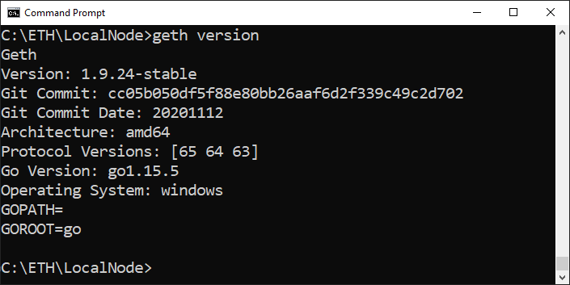
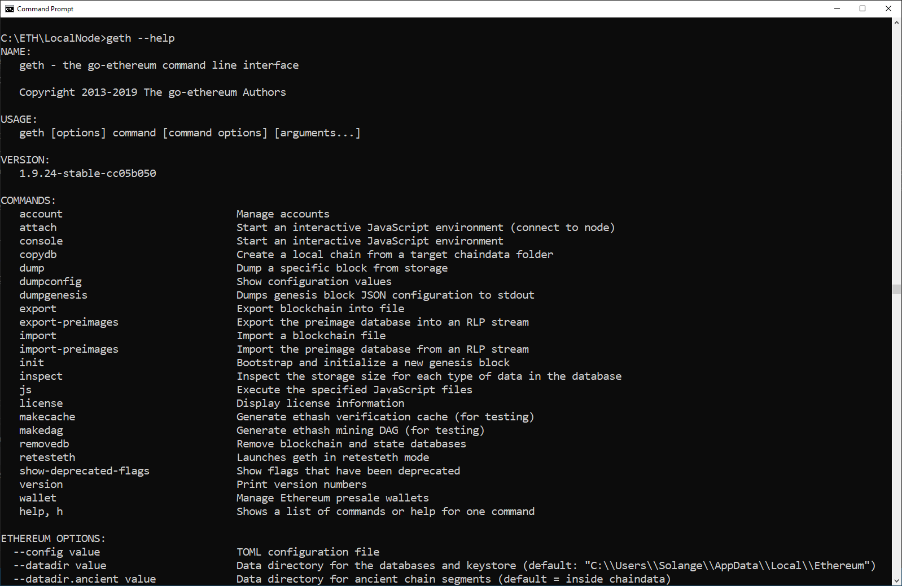

# Instalando Geth

Existem várias formas de instalar Geth:

- usando um gerenciador de pacotes - package manager;
- baixar um pacote pré-construído autônomo - pre-built bundle;
- funcionando como um contêiner docker;
- fazendo o deploy você mesmo.

<!-- tabs:start -->

#### ** Linux **

### Instalando Geth no Linux

Digite os comandos abaixo no bash para instalar Geth:

```shell
mkdir -p ~/code/ethereum/geth-node
cd ~/code/ethereum/geth-node
curl \
  -L \
  https://gethstore.blob.core.windows.net/builds/geth-darwin-amd64-1.9.24-cc05b050.tar.gz
  > geth-darwin-amd64-1.9.24-cc05b050.tar.gz

tar -xf geth-darwin-amd64-1.9.24-cc05b050.tar.gz

cd geth-darwin-amd64-1.9.24-cc05b050

ls -l

./geth version
```

Linux tem muitas versões diferentes, então vá para a 
[official install Geth page](https://geth.ethereum.org/docs/install-and-build/installing-geth)
para encontrar outras opções para instalar Geth.

#### ** Mac OS **

### Instalando Geth no Mac OS

A maneira mais fácil é usando [Homebrew](https://brew.sh/).

Se você ainda não tem instalado, execute este comando no terminal para instalar `Homebrew`:

```shell
/bin/bash -c "$(curl -fsSL https://raw.githubusercontent.com/Homebrew/install/master/install.sh)"
```

E depois instale `Geth`:

```shell
brew tap ethereum/ethereum
brew install ethereum
```

#### ** Windows OS **

[geth-install-windows](geth-install-windows.md ':include')

<!-- tabs:end -->

> [!NOTE]
> Este tutorial foi realizado com a versão 1.9.24, Recomendo usar a mesma versão.

## Geth version

No terminal, execute este comando para verificar a versão, se ele retornar uma versão, significa que `geth` foi instalado com sucesso:

```shell
geth version
```



## Geth help

O help da linha de comandos é muito útil:

```shell
geth --help
```



## Executando Geth

> [!ATTENTION] 
> Por padrão, Geth se conecta a Mainnet.> >
> Executando `geth` no terminal, 
> ele vai começar a fazer download de toda a base de dados da rede principal do Ethereum!
> 
> Se o seu objetivo é utilizar Geth em uma rede específica, não execute `geth` sem nenhum parâmetro.

Vá para o próximo tutorial antes de fazer isto.

[Geth - crie um nó local](/pt/geth/geth-local-node.md)

:sun_with_face:

## Reference links

- [Official install Geth page](https://geth.ethereum.org/docs/install-and-build/installing-geth)

- [Geth documentation](https://geth.ethereum.org/docs/)

- [Archived Geth documentation](https://github.com/ethereum/go-ethereum/wiki)

- [List of stable releases](https://github.com/ethereum/go-ethereum/releases)

