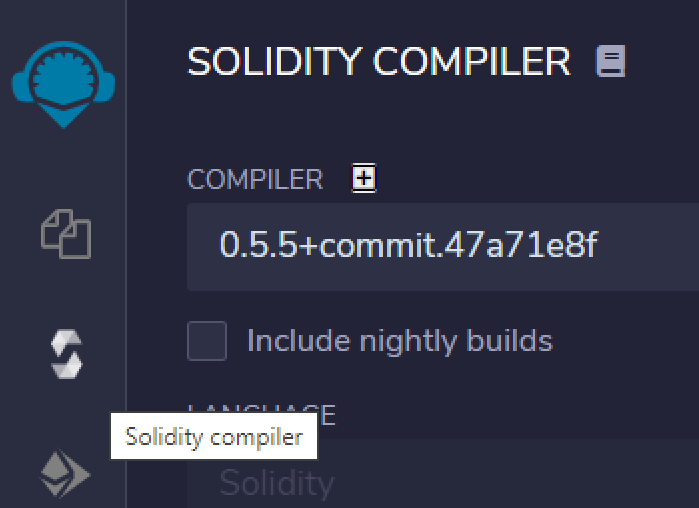
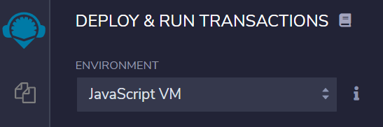
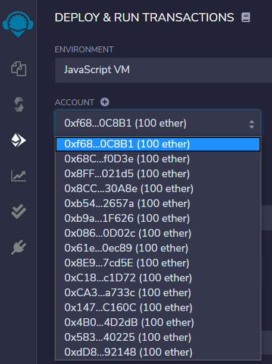
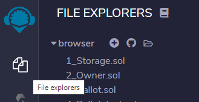

# Remix

Remix é uma ferramenta online. É um IDE (Integrated Development Environment - ambiente de desenvolvimento integrado) usado para escrever, compilar, publicar e depurar código fonte em Solidity. Pode ser conectado a uma carteira web, como o Metamask, e, através desta conexão, ser utilizado para publicar contratos inteligentes em diversas redes.

Pode ser acessado em 
[remix.ethereum.org](http://remix.ethereum.org/)

## Environment Solidity

Na página inicial - home / welcome page, escolha environment `Solidity`

## Terminal

No Remix, na parte de baixo, à direita, existe um terminal com algumas bibliotecas disponíveis.

Você pode enviar comandos e transações por aqui. 
Também apresenta o resultado das transações e / ou chamadas às funções de smart contracts.

> [!NOTE]
> Esta área de retorno é muito importante para acompanhar os resultados!

## Compilador Solidity

Clique no 3o botão do lado esquerdo - Solidity compiler

Habilite o auto-compile para compilar automaticamente os contratos inteligentes durante a edição no Remix.

## Deploy and run transactions

No painel à esquerda, clique no botão `Deploy and run transactions`. 
Atualmente é o 4o botão.

O Remix possui o ambiente `JavaScriptVM`, um simulador de Blockchain que acontece na memória do browser.

## Accounts

Este simulador possui diversos endereços / contas com Ethers fictícios que podemos escolher para publicar um smart contract ou interagir com ele.

Veja um exemplo de lista de contas:

A cada vez que você inicia o Remix ou faz uma atualização na página, pode ser que a lista de contas se altere.

## Smart contracts

Os smart contracts ficam localizados no 2o botão do lado esquerdo: `file explorers`

